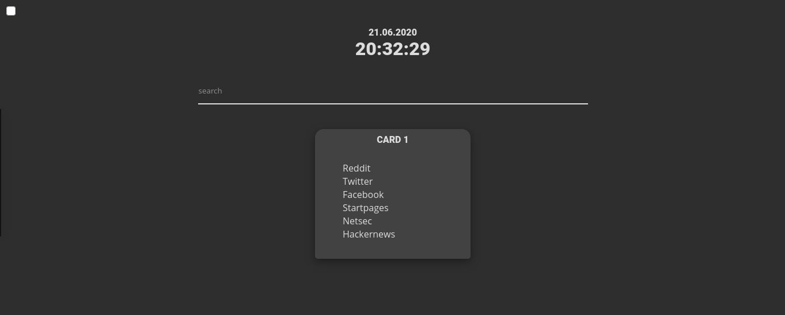

# Startpage

Simple HTML Startpage that displays the time, date, a searchbar and customizable (plus hideable) cards.



The startpage is generated using the `generate.py` Python3 script, so that one does not need to fiddle with HTML code when needing new cards or change links.

*HTML* code is generated using [Jinja2](https://jinja.palletsprojects.com/en/2.11.x/) templates. That way cards can be dynamically created using a YAML config file (see [config/config-template.yml](config/config-template.yml)).

*CSS* is generated using [Sass](https://sass-lang.com/) - so that the design of the site can be easily altered/extended when needed.

*Javascript* Code does not use any libraries, as I see no need in using them with such simple implemented functionality.

*Fonts* - just some basic embedded Google Fonts ([Roboto](https://fonts.google.com/specimen/Roboto) and [Open Sans](https://fonts.google.com/specimen/Open+Sans))

## Demo

A demo of the startpage is hosted via github-pages under: [https://b-01.github.io/startpage/](https://b-01.github.io/startpage/)

# Generating a Startpage

To generate a new Startpage, the only requirement is [Python3](https://www.python.org/downloads/). Everything else will be pulled in automatically using the steps below.

*the following code only works on linux based systems*

## Setting up the Environment

- Create a virtual environment  
  `python -m venv venv`

- Activate virtual environment  
  `source venv/bin/activate`

- Update PIP  
  `pip install -U pip`

- Install required packages  
  `pip install -r requirements.txt`

- Optionally install development requirements (linter, code formatter ...)  
  `pip install -r requirements-dev.txt`

## Visual Studio Code Tasks

If you use Visual Studio Code you can open the folder and run one of the provided tasks which essentially run the next steps automatically:
- Prepare Assets
- Build Site
- Build All

Else you can also run those next steps manually.

## Prepare source files

Change Javascript, fonts, SCSS files, add assets, add/change templates ...

Then either run `prepare.sh` or run the appropiate commands from this file directly.

## Generate HTML

To generate the HTML file using the python script, first activate the environment: `source venv/bin/activate`

`generate.py` needs some arguments to work. use the `-h` or `--help` switch to display all available arguments.


### generate.py --help output
```sh
$> python generate.py -h

usage: generate.py [-h] [-v] [-o OUTPUT_PATH] [-1] [-f] [-s SOURCE_PATH] config template

Generate the Startpage HTML.

positional arguments:
  config                path to the config file
  template              path to the template file

optional arguments:
  -h, --help            show this help message and exit
  -v, --verbose         More verbose output
  -o OUTPUT_PATH, --output-path OUTPUT_PATH
                        path to output the finished Startpage files to
  -1, --one-file        Include all files into one big HTML file
  -f, --force-overwrite
                        when present, overwrites any existing file under 'output_path'
  -s SOURCE_PATH, --source-path SOURCE_PATH
                        path where all the resource files are stored (css, js, img etc.)
```

# Acknowledgement

Found the startpages of many talented users on Reddits [/r/startpages](https://www.reddit.com/r/startpages/) and wanted to create my own. As my HTML/CSS foo is not good enough, I borrowed some stuff. Many thanks to:

- [u/interestingquoter](https://www.reddit.com/user/interestingquoter/) - Favicons on hover: https://github.com/arbitrarily/startpage
- [u/s1ck_](https://www.reddit.com/user/s1ck_/) - Search bar styling: https://github.com/aftabm25/StartPage
- [u/imVampi](https://www.reddit.com/user/imVampi/) - Javascript for search bar: https://github.com/imVampi/Asuka-Start
